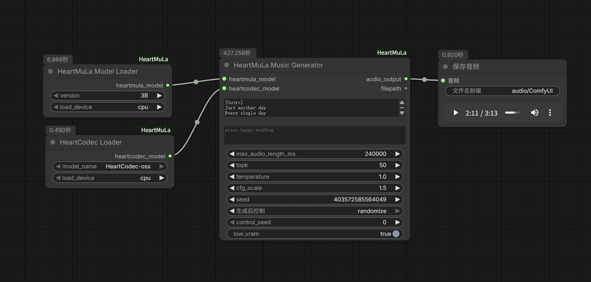

# HeartMuLa ComfyUI (显存优化版)

这是一个为 [ComfyUI](https://github.com/comfyanonymous/ComfyUI) 开发的自定义节点插件，用于支持 **HeartMuLa** 音乐生成模型和歌词转录功能。

本项目基于 [benjiyaya/HeartMuLa_ComfyUI](https://github.com/benjiyaya/HeartMuLa_ComfyUI) 进行二次开发，并在原项目基础上进行了深度优化，使其能够在消费级显卡（低至 12GB VRAM 甚至更低）上流畅运行。

## 🎵 功能特点与优化

为了解决原版插件中显存占用过高的问题，我们进行了以下关键改进：

1.  **模块化节点设计**:
    *   我们将原本耦合在一起的单体节点拆分为独立的**加载器 (Loaders)** 和 **生成器 (Generator/Transcriptor)**。
    *   用户可以灵活组合，仅加载需要的模型部分。

2.  **低显存优化 (Low VRAM Support)**:
    *   实现了智能显存管理策略。在开启 `Low VRAM Mode`（默认开启）时，模型平时驻留在 CPU 内存中。
    *   仅在生成/推理的瞬间将当前需要的模型（如 Transformer 或 Codec）移动到 GPU，推理完成后立即释放显存。
    *   这使得 3B 版本的模型可以在 **12GB 显存** 的设备上运行，甚至更低配置的设备也能尝试。

3.  **自动模型下载**:
    *   无需手动下载繁琐的模型文件。首次运行时，插件会自动检测并从 HuggingFace 官方仓库下载所需的模型权重到 `ComfyUI/models/HeartMuLa` 目录。

4.  **灵活的设备加载选项**:
    *   加载器节点提供了 `load_device` 选项。
    *   **CPU**: 节省显存，适合小显存显卡。
    *   **CUDA**: 直接加载到显存，适合 24GB+ 大显存设备，生成速度更快。

## 🛠️ 安装方法

### 方法一：通过 ComfyUI Manager 安装（推荐）

1.  在 ComfyUI Manager 中搜索 `HeartMuLa`。
2.  点击安装即可。

### 方法二：手动安装

1.  进入您的 ComfyUI 自定义节点目录：
    ```bash
    cd ComfyUI/custom_nodes
    ```
2.  克隆本项目：
    ```bash
    git clone https://github.com/DocWorkBox/HeartMuLa_ComfyUI
    ```
3.  重启 ComfyUI 即可（依赖将在首次运行时自动安装）。

## 🚀 使用说明

启动 ComfyUI 后，您可以在节点列表中找到 `HeartMuLa` 分类。

### 推荐工作流



**音乐生成 (Music Generation):**
1.  添加 `HeartMuLa Model Loader` 节点，选择版本（如 3B）。
2.  添加 `HeartCodec Loader` 节点。
3.  添加 `HeartMuLa Music Generator` 节点。
4.  将前两个节点的输出连接到 Generator 的对应输入。
5.  输入歌词 (`lyrics`) 和标签 (`tags`)，点击运行即可。

**歌词转录 (Lyrics Transcription):**
1.  添加 `HeartTranscriptor Loader` 节点。
2.  添加 `Load Audio` 节点（ComfyUI 自带）。
3.  添加 `HeartTranscriptor` 节点。
4.  连接模型和音频输入，点击运行获取歌词文本。

## 📖 节点参数说明 (Node Parameters)

### 1. HeartMuLa Music Generator (音乐生成)
*   **max_audio_length_ms**: 生成音频的最大长度（毫秒）。例如 `60000` 代表 1 分钟。
*   **topk**: 采样策略参数，控制生成的多样性。
*   **temperature**: 温度参数，控制生成的随机性。
*   **cfg_scale**: 分类器自由引导比例 (Classifier-Free Guidance)，控制生成内容对提示词的遵循程度。
*   **control_seed**: 控制生成的种子，用于复现结果。
*   **low_vram**: 开启低显存模式（默认开启），生成完毕后自动释放显存。

### 2. HeartTranscriptor (歌词转录)
*   **max_new_tokens**: 单次生成的最大 Token 数量。默认为 `400`。
*   **language**: 语言设置。默认 `auto` (自动检测)，如果识别不准确（如开头有长静音导致误判），请手动选择对应语言（如 `zh`）。
*   **temperature**: 采样温度。默认为 `0.0` (最确定)，如果识别结果卡住或重复，可尝试微调至 `0.2`。
*   **batch_size**: 批处理大小。默认为 `4`。显存较大时可调大此值以加快速度。
*   **chunk_length_s**: 音频切片长度（秒）。默认为 `30`。Whisper 模型标准输入长度。
*   **stride_length_s**: 切片重叠步长（秒）。默认为 `5`。用于解决长音频切片边界的识别问题。如果歌词在间奏处断开，请尝试**调大**此值（如 `8` 或 `10`）。
*   **no_speech_threshold**: 静音阈值。默认为 `0.4`。
*   **logprob_threshold**: 对数概率阈值。默认为 `-1.0`。表示模型对生成内容的“自信程度”。如果生成的平均对数概率低于此值，模型会认为生成失败（可能是幻觉或噪音）并尝试跳过。如果发现正常歌词被丢弃，可以尝试将其调低（如 `-2.0` 或更低）。
*   **low_vram**: 低显存模式开关。

## 📂 模型文件结构

插件会自动处理模型下载，默认目录结构如下：
```
ComfyUI/models/HeartMuLa/
├── HeartMuLaGen/ (配置文件)
├── HeartMuLa-oss-3B/ (生成模型权重)
├── HeartCodec-oss/ (音频编解码权重)
└── HeartTranscriptor-oss/ (转录模型权重)
```

## � 关注作者 (Follow Me)

*   **Bilibili**: [Doc_workBox的个人空间](https://b23.tv/ZEbk9dQ)
*   **YouTube**: [Doc的工具箱](https://youtube.com/@doc_workbox?si=pw2IrWob8D7nJYlH)

## �🙏 致谢 (Acknowledgements)

特别感谢 [benjiyaya](https://github.com/benjiyaya) 提供的初始 ComfyUI 插件实现，为我提供了良好的开发基础。

同时感谢 **HeartMuLa** 团队开源了如此优秀的音乐生成模型。

*   **Based on**: [benjiyaya/HeartMuLa_ComfyUI](https://github.com/benjiyaya/HeartMuLa_ComfyUI)
*   **Original Model Repo**: [HeartMuLa/heartlib](https://github.com/HeartMuLa/heartlib)
*   **Paper**: [HeartMuLa: A Family of Open Sourced Music Foundation Models](https://arxiv.org/abs/2601.10547)
*   **Demo**: [Project Page](https://heartmula.github.io/)

### 模型引用
*   HeartMuLa-oss-3B: https://huggingface.co/HeartMuLa/HeartMuLa-oss-3B
*   HeartCodec-oss: https://huggingface.co/HeartMuLa/HeartCodec-oss
*   HeartTranscriptor-oss: https://huggingface.co/HeartMuLa/HeartTranscriptor-oss

如果您觉得本项目有用，请去原项目点个 Star！🌟
